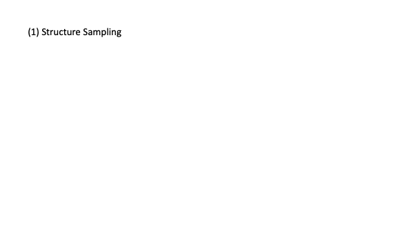

# Equation Tree

The Equation Tree package is an equation toolbox with symbolic regression in mind. It represents
expressions as incomplete binary trees and has various features tailored towards testing symbolic
regression algorithms or training models. The most notable features are:

- Equation sampling (including priors)
- Feature Extraction from equation distributions
- Distance metrics between equations

## Equation Sampling

In our sampling method, the equation structure and the equation content are sampled in two steps:
- (1) First, we sample the *structure* of the equation
- (2) Second, we sample the *content* of the equation

The sampling can be customized to obtain a desired equation distribution. For example, to mimic the distribution in specific scientific fields. This is customization is implemented in form of priors for operators, functions, features, and structures. We can also use conditional priors conditioned on the parent node. 

## Feature Extraction

Given an equation, our package can extract features like number of constants, and variables, and various equation complexity measurements (For example, number of nodes and tree depth.)

For a list of equations, our package is capable to easily access frequencies for operators, functions, features, and structures. These frequencies can in turn be used to sample new equations that mimic the original list in these aspects.

## Distance Metrics

For benchmarking or training, the Equation Tree package features a list of distance metrics between equations:

- **Prediction distance.** Prediction distance between function values as proposed byLa Cava et al. (2021):
- **Symbolic solution.** Another metric proposed by La Cava et al. (2021) is called symbolic solution, designed to capture SR models that differ from the true model by a constant or scalar. In our application, we define the symbolic constant difference as:
- **Normalized edit distance.** In addition to the metrics above, Matsubara et al. (2022) propose a normalized edit distance for the trees. For a pair of two trees, edit distance computes the minimum cost to transform one to another with a sequence of operations, each of which either 1) inserts, 2) deletes, or 3) renames a node. 

## Relevant Publication

For reference and informations about the evaluation of our package, read our Neuroips 2023 paper:

Marinescu*, I., Strittmatter*, Y, Williams, C, Musslick, S. "Expression Sampler as a Dynamic Benchmark for Symbolic Regression." In *NeurIPS 2023 AI for Science Workshop*. (2023), [Read the publication](https://openreview.net/forum?id=i3PecpoiPG). [*equal contribution]

## About

This project is in active development by
the <a href="https://musslick.github.io/AER_website/Research.html">Autonomous Empirical Research
Group</a>
(package developer: <a href="https://younesstrittmatter.github.io/">Younes Strittmatter</a>,
PI: <a href="https://smusslick.com/">Sebastian Musslick</a>. This research program is supported by
Schmidt Science Fellows, in partnership with the Rhodes Trust, as well as the Carney BRAINSTORM
program at Brown University.

## References

La Cava, W. G., Orzechowski, P., Burlacu, B., de França, F. O., Virgolin, M., Jin, Y., Kommenda, M., & Moore, J. H. "Contemporary Symbolic Regression Methods and their Relative Performance." In *CoRR* (2021), Available at: [https://arxiv.org/abs/2107.14351](https://arxiv.org/abs/2107.14351)

Matsubara, Y., Chiba, N., Igarashi, R., & Ushiku, Y. "Rethinking symbolic regression datasets and benchmarks for scientific discovery." In *arXiv preprint arXiv:2206.10540*. (2022), Available at: [https://arxiv.org/abs/2206.10540](https://arxiv.org/abs/2206.10540)

